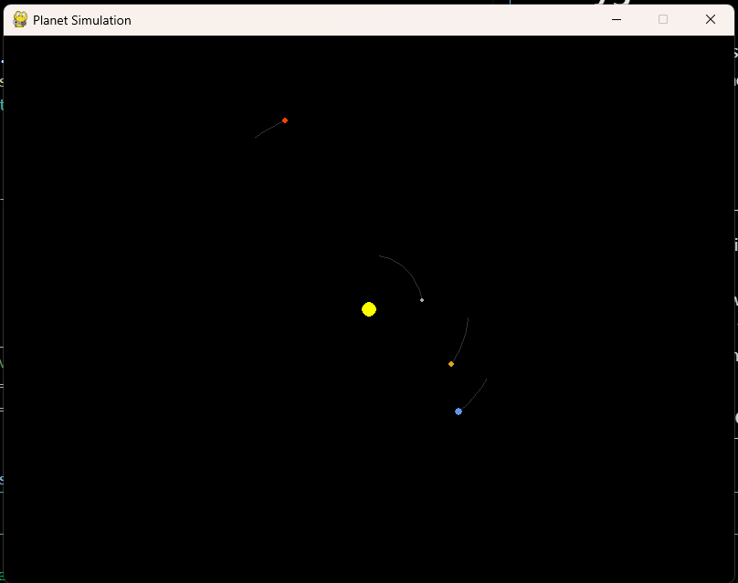

# 🌌 Planet Simulation in Python using Pygame

This project simulates the motion of planets in a solar system using Newtonian gravity and visualizes it in real-time using the `pygame` library.

<p align="center">
  
</p>

## 🚀 Features

- Simulates gravitational interaction between celestial bodies.
- Realistic orbits using accurate masses, distances, and velocities.
- Scalable view with a toggleable zoom (`Z` key).
- Trail rendering to show orbital paths.
- Visual representation of all 8 planets + Sun.

## 🛠 Technologies Used

- **Python 3**
- **Pygame** for graphics and display
- **Math** for gravitational calculations

## 🪐 Bodies Included

| Planet   | Color       | Radius (display) | Approx. Orbital Speed |
|----------|-------------|------------------|------------------------|
| Sun      | Yellow      | 8                | 0                      |
| Mercury  | Grey        | 2                | 47,870 m/s            |
| Venus    | Golden      | 3                | 35,020 m/s            |
| Earth    | Blue        | 4                | 29,780 m/s            |
| Mars     | Red         | 3                | 24,070 m/s            |
| Jupiter  | Orange-Brown| 6                | 13,070 m/s            |
| Saturn   | Pale Golden | 5                | 9,680 m/s             |
| Uranus   | Light Blue  | 4                | 6,800 m/s             |
| Neptune  | Deep Blue   | 4                | 5,430 m/s             |

## 📷 Screenshot

 

## ⌨️ Controls

- `Z`: Toggle between **full scale** and **zoomed-in view**.
- `Close Button`: Exit the simulation.

## 📦 Installation

1. **Clone the repository:**
   ```bash
   git clone https://github.com/yourusername/planet-simulation.git
   cd planet-simulation
   ```

2. **Install dependencies:**

   ```bash
   pip install pygame
   ```

3. **Run the simulation:**

   ```bash
   python simulation.py
   ```

## ⚙️ How It Works

* Newton’s Law of Gravitation is applied to each body:

  $$
  F = G \cdot \frac{{m_1 \cdot m_2}}{{r^2}}
  $$
* Acceleration is derived using $a = F / m$.
* Position and velocity are updated using the time step (`DT = 86400` seconds = 1 day).
* Trails are drawn to visualize the orbital paths.

## 🧠 Learning Objectives

* Understand N-body gravitational simulations.
* Learn how to implement physics in Python.
* Practice using Pygame for 2D animations and rendering.

## 📌 Future Improvements

* Add moons or asteroids.
* Add GUI controls to adjust zoom, time step, or reset simulation.
* Add real-time velocity/acceleration indicators.
* Sound effects or planetary information tooltips.

## 📝 License

This project is open-source and available under the [MIT License](LICENSE).

---

> Made with 💫 by Arpan Saha.